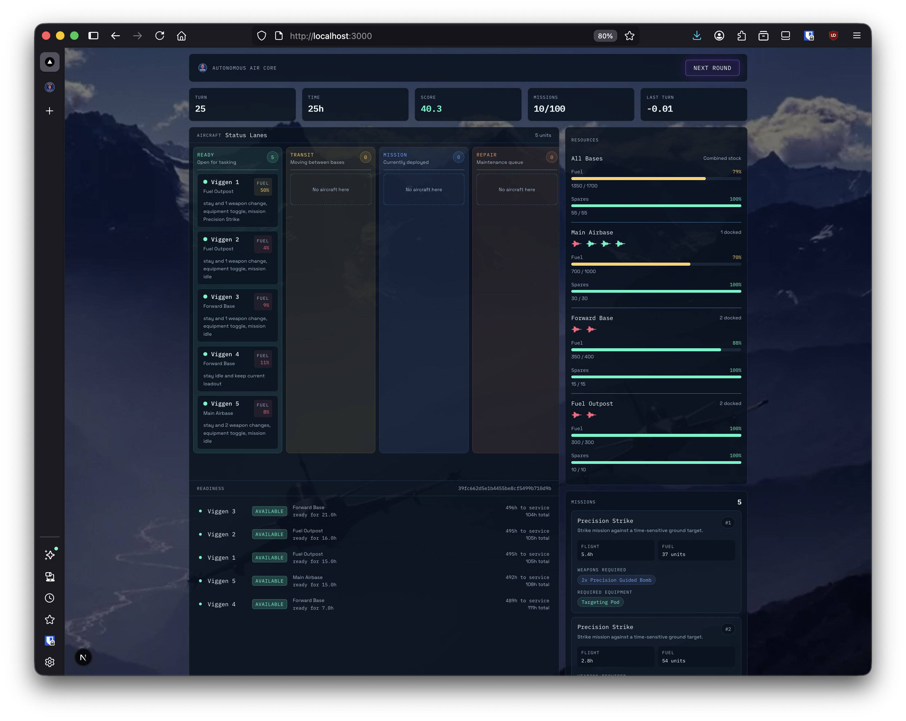

# SmartAirbase - Autonomous Airbase Management

**Description**

SmartAirbase is an autonomous airbase management system that uses reinforcement learning to optimize aircraft maintenance and transfer decisions. The system is designed to operate in a simulated environment where an AI agent controls a fleet of aircraft and makes decisions about maintenance, transfers, refueling, and mission assignments to maximize mission success and minimize downtime.

This project is part of the SAAB Hackathon 2026, which challenged participants to create a smart airbase. Our team had already built another part of the project that simulates the airbase and the aircraft for educational purposes, and this repository focuses on training a reinforcement learning agent to control the airbase and the aircraft.

I did not have enough time to deploy a fully trained model for the hackathon, so we had to use a "stupid" trained model that could not make optimal decisions. It would sometimes refuel an aircraft even when it already had 100% fuel, which was pretty funny. There may also be a bug in the code that caused the agent to refuel an aircraft even when it already had more than about 80% fuel.

The project does not have a very clean folder structure because it was built quickly, like a real hackathon project.

The hackathon was fun, and we learned a lot.


*Björn*

-----

## Reinforcement Learning Agent

**Description**

My goal was to create a reinforcement learning agent that can control the airbase and the aircraft so that it can make optimal decisions about maintenance, transfers, refueling, and mission assignments to maximize mission success and minimize downtime.

One thing I hoped to achieve was a system that could recognize when it should move aircraft with the highest flight hours back to the main base. When an aircraft is getting close to full service, it may break down more often, although not dramatically more often than usual. This was one of the main behaviors I wanted the model to learn, but it may not be possible yet because the simulation is still not realistic enough. For example, I did not add constraints such as preventing a seriously damaged aircraft from being transferred to the main base. Right now, even if an aircraft is damaged, it can still fly to another airbase, so the model may not prioritize moving high-flight-hour aircraft back to the main base.

Another thing I hoped to achieve was a system that could recognize when it should change an aircraft's weapons. Right now, we have 3 types of weapons and 6 hardpoints for each aircraft. Weapons need to be swapped carefully because each hardpoint can support only certain weapon types, and not all of them at the same time. Changing weapons takes time, so it should be done wisely.

For now, we have not added mission timing because this was only meant to be a prototype and time was limited.

You can also check `game.ipynb` to see how the trained agent is performing.

**Technical Details**

The RL agent is trained using the Stable Baselines3 library and the PPO algorithm. It is trained in a simulated airbase environment where it can make decisions about maintenance, transfers, refueling, and mission assignments.

The agent is first trained with a hyperparameter tuning sweep and then trained again as the final model using the best hyperparameter configuration.

The agent uses a masked action space because some actions are not valid in certain situations. This helps avoid wasting training time.

If no aircraft are ready for a mission, the agent receives a penalty.

If the airbase does not have enough fuel for refueling, the agent receives a penalty.

If the airbase does not have enough weapons available for a loadout change, the agent receives a penalty.

----

## Training

Run a hyperparameter tuning sweep with:

```bash
mamba run -n gat-train python sweep_train.py --tuning
```

Run the final training after tuning with:

```bash
mamba run -n gat-train python sweep_train.py --final
```

`--final` uses `final_training.selected_profile` from `training_profiles.yml` when it is set. If it is empty or `best`, it reuses the best hyperparameter configuration from the latest tuning summary in `artifacts/`.

----

## Quick Start for Demo (Requires Docker)

1. Update `.env` with your Discord webhook and any training overrides you want.
2. Run the command: `docker compose up --build -d`

----

## Discord notifications

Discord notifications are optional. When enabled, the sweep sends:

- one message when the sweep starts
- one message every configured 10% of overall scheduled progress
- one message on failure
- one message when the sweep completes

----

# Watch How the Trained Agent Is Performing

**Description**

By running `mamba run -n gat-train python play.py`, you can watch how the trained agent performs in the CLI.

If you prefer a web interface, you can run `cd frontend && npm run dev`.
